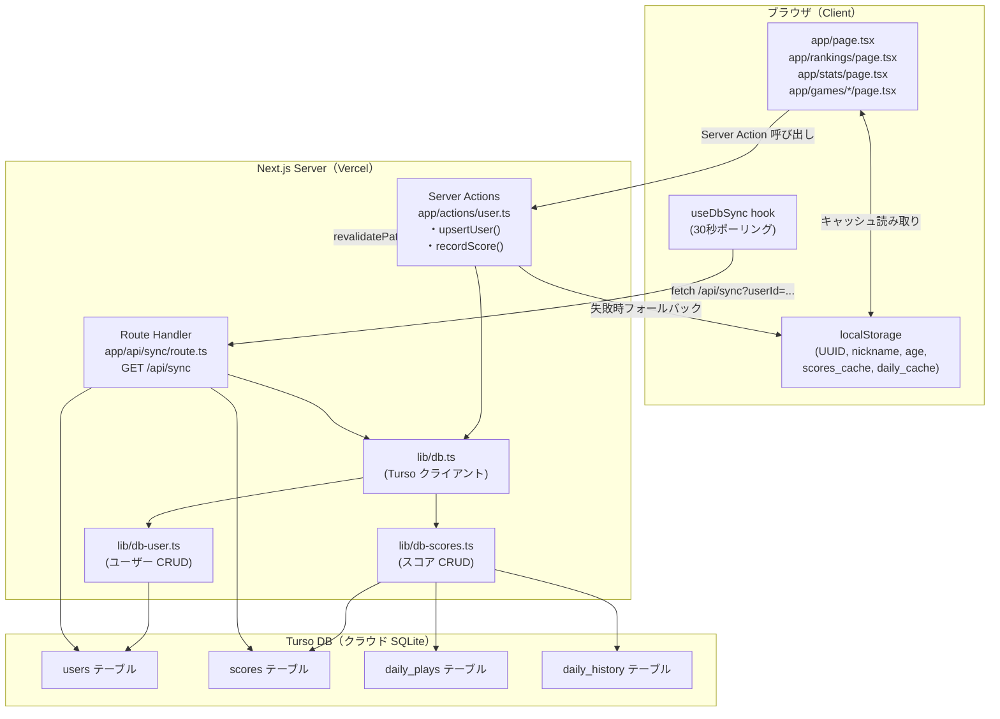

# 基本設計書: Turso DB 統合・リアルタイム同期

## 1. アーキテクチャ図



---

## 2. DB スキーマ

### 2-1. users テーブル

```sql
CREATE TABLE IF NOT EXISTS users (
  id           TEXT PRIMARY KEY,
  nickname     TEXT NOT NULL,
  age          INTEGER,
  created_at   TEXT NOT NULL,
  updated_at   TEXT NOT NULL
);
```

| カラム | 型 | 説明 |
|---|---|---|
| id | TEXT PK | `crypto.randomUUID()` で生成した UUID（クライアント生成） |
| nickname | TEXT NOT NULL | ニックネーム（最大 12 文字） |
| age | INTEGER | 年齢（任意。NULL 許容） |
| created_at | TEXT | ISO 8601 形式（例: "2026-05-11T09:00:00.000Z"） |
| updated_at | TEXT | 更新のたびに書き換える |

### 2-2. scores テーブル

```sql
CREATE TABLE IF NOT EXISTS scores (
  id           INTEGER PRIMARY KEY AUTOINCREMENT,
  user_id      TEXT NOT NULL,
  game_id      TEXT NOT NULL,
  score        REAL NOT NULL,
  created_at   TEXT NOT NULL,
  FOREIGN KEY (user_id) REFERENCES users(id)
);

CREATE INDEX IF NOT EXISTS idx_scores_game_id ON scores(game_id);
CREATE INDEX IF NOT EXISTS idx_scores_user_id ON scores(user_id);
```

| カラム | 型 | 説明 |
|---|---|---|
| id | INTEGER PK | 自動採番 |
| user_id | TEXT NOT NULL | users.id への FK |
| game_id | TEXT NOT NULL | "calculation" / "memory-number" / "stroop" / "reaction" / "pattern" |
| score | REAL NOT NULL | スコア値（整数ゲームも REAL で統一） |
| created_at | TEXT | ISO 8601 形式 |

### 2-3. daily_plays テーブル

```sql
CREATE TABLE IF NOT EXISTS daily_plays (
  user_id      TEXT NOT NULL,
  game_id      TEXT NOT NULL,
  play_date    TEXT NOT NULL,
  play_count   INTEGER DEFAULT 0,
  best_score   REAL,
  PRIMARY KEY (user_id, game_id, play_date)
);
```

| カラム | 型 | 説明 |
|---|---|---|
| user_id | TEXT NOT NULL | PK の一部 |
| game_id | TEXT NOT NULL | PK の一部 |
| play_date | TEXT NOT NULL | "YYYY-MM-DD" 形式。PK の一部 |
| play_count | INTEGER | 当日のプレイ回数（0〜3） |
| best_score | REAL | 当日のベストスコア（NULL = まだプレイなし） |

### 2-4. daily_history テーブル

```sql
CREATE TABLE IF NOT EXISTS daily_history (
  user_id      TEXT NOT NULL,
  play_date    TEXT NOT NULL,
  total_points INTEGER DEFAULT 0,
  games_played INTEGER DEFAULT 0,
  PRIMARY KEY (user_id, play_date)
);
```

| カラム | 型 | 説明 |
|---|---|---|
| user_id | TEXT NOT NULL | PK の一部 |
| play_date | TEXT NOT NULL | "YYYY-MM-DD" 形式。PK の一部 |
| total_points | INTEGER | その日の累計ポイント |
| games_played | INTEGER | その日にプレイした種目数 |

---

## 3. データフロー

### 3-1. 初回ユーザー登録

```
[ブラウザ初回アクセス]
  │
  ├─ localStorage.getItem("braingame_user_id") → null（未設定）
  │
  ├─ NicknameModal 表示
  │
  ├─ ユーザーがニックネーム・年齢を入力して送信
  │
  ├─ クライアント: crypto.randomUUID() → userId 生成
  │
  ├─ localStorage.setItem("braingame_user_id", userId)
  ├─ localStorage.setItem("braingame_nickname", nickname)
  ├─ localStorage.setItem("braingame_age", age)
  │
  └─ Server Action: upsertUser({ id: userId, nickname, age })
       │
       ├─ 成功: Turso users テーブルに INSERT（id が重複する場合は UPDATE nickname/age/updated_at）
       └─ 失敗: コンソールに警告を出力してサイレント処理（localStorage には保存済み）
```

### 3-2. スコア保存

```
[ゲーム終了 → ResultModal 表示]
  │
  ├─ クライアント: localStorage から userId・nickname を取得
  │
  ├─ Server Action: recordScore({ userId, gameId, score, nickname })
  │   │
  │   ├─ 1. scores テーブルに INSERT (user_id, game_id, score, created_at)
  │   │
  │   ├─ 2. daily_plays テーブルを UPSERT
  │   │       play_count += 1
  │   │       best_score = lowerIsBetter ? MIN(best_score, score) : MAX(best_score, score)
  │   │
  │   ├─ 3. daily_plays から当日の全ゲームのベストを取得
  │   │
  │   ├─ 4. ポイント計算（lib/game-points.ts の calcGamePoints と同ロジック）
  │   │       total_points と games_played を算出
  │   │
  │   ├─ 5. daily_history テーブルを UPSERT（user_id, play_date）
  │   │
  │   ├─ 6. revalidatePath("/rankings") 呼び出し
  │   │
  │   └─ 失敗時: try-catch でエラーをキャッチ → エラーオブジェクトを return
  │
  ├─ クライアント: localStorage の個人ベスト・デイリーも同期更新（楽観的更新）
  │
  └─ ResultModal に新ベスト・ポイントを表示
```

### 3-3. データ取得（ランキング・ポーリング）

```
[ランキング画面 or useDbSync ポーリング（30秒間隔）]
  │
  ├─ fetch("/api/sync?userId=<uuid>")
  │
  ├─ Route Handler (GET /api/sync)
  │   │
  │   ├─ userId をクエリパラメータから取得
  │   ├─ getScoresFromDb(userId) → 個人ベスト一覧
  │   ├─ getRankingsFromDb() → 全ユーザーのゲーム別・総合ランキング
  │   ├─ getDailyDataFromDb(userId, today) → デイリー残回数・ベスト
  │   └─ レスポンス: JSON { personalBests, gameRankings, overallRanking, dailyPlays, dailyHistory }
  │
  ├─ 成功時: useState を更新 → 画面再レンダリング
  │   └─ localStorage のキャッシュも更新（次回オフライン時のフォールバック用）
  │
  └─ 失敗時: 前回の state をそのまま保持（エラー表示なし）
```

---

## 4. リアルタイム同期方式

### 採用方式: クライアントポーリング（30 秒間隔）+ revalidatePath

#### ポーリング実装（useDbSync hook）

```
- 対象画面: app/rankings/page.tsx のみ（ホーム・統計はポーリング不要）
- 間隔: 30,000ms（30 秒）
- 実装: useEffect 内で setInterval を使用
- タブ非表示時: document.visibilitychange イベントでポーリングを一時停止
- アンマウント時: clearInterval で停止
- 初回: コンポーネントマウント直後にも即時フェッチ（インターバル待ちなし）
```

#### revalidatePath

```
- recordScore Server Action の末尾で revalidatePath("/rankings") を呼び出す
- 効果: Next.js サーバーのキャッシュが無効化され、次回アクセス時に新しいランキングが返る
- ポーリングと組み合わせると最大 30 秒以内に全クライアントに反映される
```

#### 採用しなかった方式とその理由

| 方式 | 不採用理由 |
|---|---|
| SSE（Server-Sent Events） | Vercel の Node.js Runtime で 10 秒制限があり、長時間接続が維持できない |
| Turso Embedded Replicas | サーバーレス環境（Vercel）ではファイルシステムが必要なため使用不可 |
| Turso Sync | ベータ段階で Next.js 14 との動作検証が不十分 |
| WebSocket（Pusher 等） | 追加の外部サービスと費用が発生する。ランキング用途には過剰 |

---

## 5. localStorage との共存戦略（移行期間）

### 原則: DB 優先・localStorage フォールバック

```
[データ読み取り]
  1. DB から取得を試みる（Server Action or API fetch）
  2. 成功したら DB の値を state に設定し、localStorage キャッシュも更新
  3. 失敗したら localStorage のキャッシュを参照して state に設定

[データ書き込み]
  1. localStorage に楽観的に書き込む（即時反映でゲーム体験を損なわない）
  2. DB へ非同期で書き込む（Server Action）
  3. DB 書き込み失敗はサイレントエラー（localStorage は既に更新済み）
```

### localStorage キー対応表

| localStorage キー | DB テーブル | 備考 |
|---|---|---|
| `braingame_user_id` | — | 新規追加。UUID を保存 |
| `braingame_nickname` | users.nickname | 変更なし |
| `braingame_age` | users.age | 変更なし |
| `braingame_scores` | scores（MAX集計） | DB 取得後にキャッシュ更新 |
| `braingame_rankings` | scores（全ユーザー） | DB 取得後にキャッシュ更新 |
| `braingame_daily` | daily_plays | DB 取得後にキャッシュ更新 |
| `braingame_daily_history` | daily_history | DB 取得後にキャッシュ更新 |

### 注意: 既存データの自動マイグレーションは実施しない

- 既存ユーザーの localStorage データを DB に移行する処理は実装しない
- 初回アクセス時は DB に新しいユーザーとして登録される
- 過去の localStorage スコアは引き続き localStorage から読み取られるが、ランキングには反映されない
- この割り切りにより実装複雑度を大幅に削減する

---

## 6. ファイル構成

```
lib/
  db.ts                 新規: Turso クライアント初期化（server-only）
  db-user.ts            新規: users テーブル CRUD
  db-scores.ts          新規: scores / daily_plays / daily_history CRUD
  nickname.ts           変更: getUserId() / setUserId() を追加
  scores.ts             変更: saveScore / getScores を DB 優先に変更
  daily.ts              変更: recordPlay / getDailyData を DB 優先に変更

app/
  actions/
    user.ts             新規: Server Actions（upsertUser, recordScore）
  api/
    sync/
      route.ts          新規: GET /api/sync
  page.tsx              変更: useDbSync hook を組み込み
  rankings/
    page.tsx            変更: useDbSync でポーリング
  stats/
    page.tsx            変更: 初回フェッチを API 経由に変更

components/
  NicknameModal.tsx     変更: 保存時に upsertUser を呼ぶ

hooks/
  useDbSync.ts          新規: ポーリング hook（30 秒間隔）

scripts/
  migrate-schema.ts     新規: DB スキーマ作成スクリプト
```
